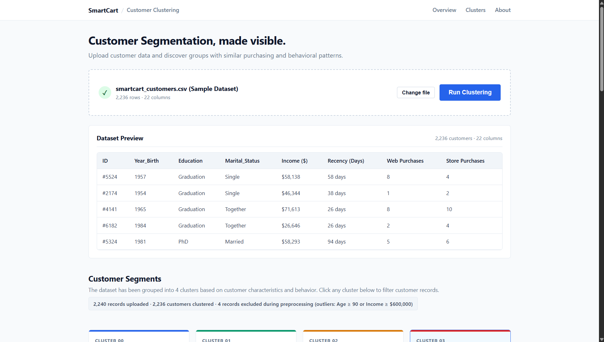
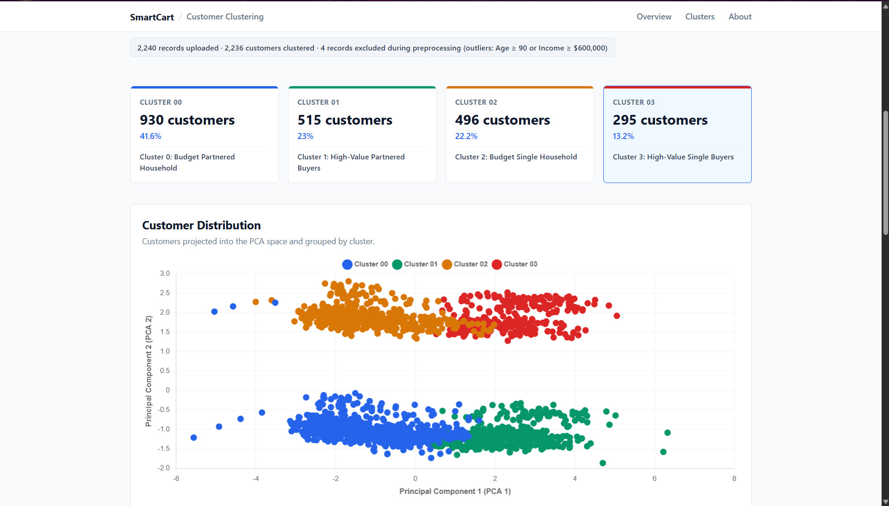
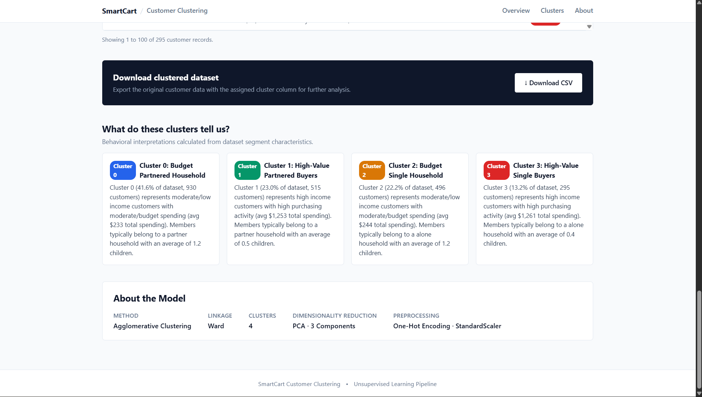

# SmartCart Clustering System

> **Customer Segmentation using Unsupervised Machine Learning**

SmartCart Clustering System is a machine learning web application built around customer purchasing, demographic, and engagement data. It uses unsupervised machine learning to group customers into distinct behavioral segments (clusters) to help businesses understand customer behavior and optimize targeted marketing strategies.

---

## 🚀 One-Command Quick Start

Run the complete application (FastAPI backend + Frontend static server) with a single command from the project root directory:

```bash
python main.py
```

This will automatically:
1. Start the FastAPI backend at `http://127.0.0.1:8000`
2. Start the Frontend dashboard at `http://127.0.0.1:5500`
3. Automatically connect the frontend to the real ML backend
4. Shut down all background servers gracefully when you press `Ctrl+C`

---

## 📌 Project Overview

This project builds a clean web application around an existing ML workflow:
- **Frontend**: Clean, human-made UI using HTML5, CSS3, and Vanilla JavaScript with Chart.js for data visualization.
- **Backend**: FastAPI REST API providing model predictions, dataset analytics, and cluster profiling.
- **Machine Learning**: Preprocessing, One-Hot Encoding, StandardScaler, 3D PCA, and **Agglomerative Clustering ($K=4$, Ward Linkage)**.

---

## 🛠️ Machine Learning Methodology

The machine learning pipeline follows the original notebook implementation:

1. **Dataset Cleaning & Imputation**: Missing values in `Income` are imputed using the median income.
2. **Feature Engineering**:
   - `Age = 2026 - Year_Birth`
   - `Customer_Tenure_Days`: Relationship tenure calculated from maximum customer joining date (`2014-06-29`).
   - `Total_Spending`: Sum of spending across Wines, Fruits, Meat, Fish, Sweets, and Gold products.
   - `Total_Children`: Sum of `Kidhome` and `Teenhome`.
   - `Education` consolidation: `Basic` and `2n Cycle` $\rightarrow$ `Undergraduate`, `Graduation` $\rightarrow$ `Graduate`, `Master` and `PhD` $\rightarrow$ `Postgraduate`.
   - `Marital_Status` consolidation: `Married` and `Together` $\rightarrow$ `Partner`, all others $\rightarrow$ `Alone`.
3. **Outlier Filtering**: Records with `Age >= 90` or `Income >= 600,000` are excluded.
4. **Encoding & Scaling**: Categorical features are encoded using `OneHotEncoder`. All 18 resulting features are scaled via `StandardScaler`.
5. **Dimensionality Reduction**: `PCA(n_components=3)` reduces scaled features into a 3D component space.
6. **Clustering**: **Agglomerative Clustering** with $K=4$ clusters and `Ward` linkage partitions the dataset.
7. **Cluster Prediction**: Out-of-sample customer prediction is computed via Euclidean distance to cluster centroids in 3D PCA space.

---

## 📂 Project Structure

```text
SmartCart-Clustering-System/
│
├── main.py              # Root launcher running both backend & frontend
│
├── frontend/
│   ├── index.html       # Single-page dashboard UI markup
│   ├── style.css        # Clean, human-made responsive styles
│   └── script.js        # Vanilla JS API fetching & Chart.js rendering
│
├── backend/
│   ├── main.py          # FastAPI app entry point & CORS configuration
│   ├── requirements.txt # Python dependency file
│   │
│   ├── routes/
│   │   ├── __init__.py
│   │   ├── prediction.py # POST /api/predict route
│   │   └── analytics.py  # GET /api/analytics & GET /api/clusters routes
│   │
│   ├── services/
│   │   ├── __init__.py
│   │   └── ml_service.py # ML pipeline bridge & metrics calculation
│   │
│   └── schemas/
│       ├── __init__.py
│       └── customer.py   # Pydantic data schemas
│
├── ml/
│   ├── pipeline.py      # Core ML pipeline execution & preprocessing
│   └── artifacts/       # Saved model artifacts & pre-clustered dataset
│
├── data/
│   └── smartcart_customers.csv # Dataset
│
├── notebooks/
│   └── smartcart.ipynb  # Original Jupyter notebook
│
├── README.md            # Documentation
└── .gitignore
```

---

## 🖥️ Project Screenshots

### 1. Dataset Overview

The dashboard starts with a clean dataset overview where users can preview customer records before running the clustering process.



---

### 2. Customer Clustering & PCA Visualization

After clustering, the dashboard shows the distribution of customers across the four clusters along with a PCA-based visualization of the customer segments.



---

### 3. Cluster Insights & Model Information

The final section provides an interpretation of each customer segment, allows the clustered dataset to be downloaded, and summarizes the machine learning approach used by the system.



---

## 📡 API Endpoints

| Method | Endpoint | Description |
|---|---|---|
| `GET` | `/health` | Server and ML pipeline health check |
| `GET` | `/api/analytics` | Overall dataset statistics & cluster counts |
| `GET` | `/api/clusters` | Comprehensive per-cluster metrics & summaries |
| `POST` | `/api/predict` | Predict cluster assignment for a new customer |

---

## 📝 Example Prediction Request

### `POST /api/predict`

#### Request Payload (JSON)
```json
{
  "Year_Birth": 1985,
  "Education": "Graduation",
  "Marital_Status": "Single",
  "Income": 75000,
  "Kidhome": 0,
  "Teenhome": 0,
  "Recency": 20,
  "Customer_Tenure_Days": 1200,
  "MntWines": 500,
  "MntFruits": 50,
  "MntMeatProducts": 300,
  "MntFishProducts": 80,
  "MntSweetProducts": 40,
  "MntGoldProds": 60,
  "NumDealsPurchases": 1,
  "NumWebPurchases": 5,
  "NumCatalogPurchases": 4,
  "NumStorePurchases": 7,
  "NumWebVisitsMonth": 3,
  "Complain": 0,
  "Response": 1
}
```

---

## 🛠️ Technologies Used

- **Python** (FastAPI, Pandas, NumPy, Scikit-Learn)
- **HTML5 & CSS3** (Semantic layout, responsive Flexbox/Grid)
- **Vanilla JavaScript** (ES6 Fetch API, DOM manipulation)
- **Chart.js** (Lightweight canvas charts)
- **Uvicorn** (ASGI web server)

---

## 👨‍💻 Author

**Adarsh Jaiswal**

B.Tech — Computer Science & Engineering

---